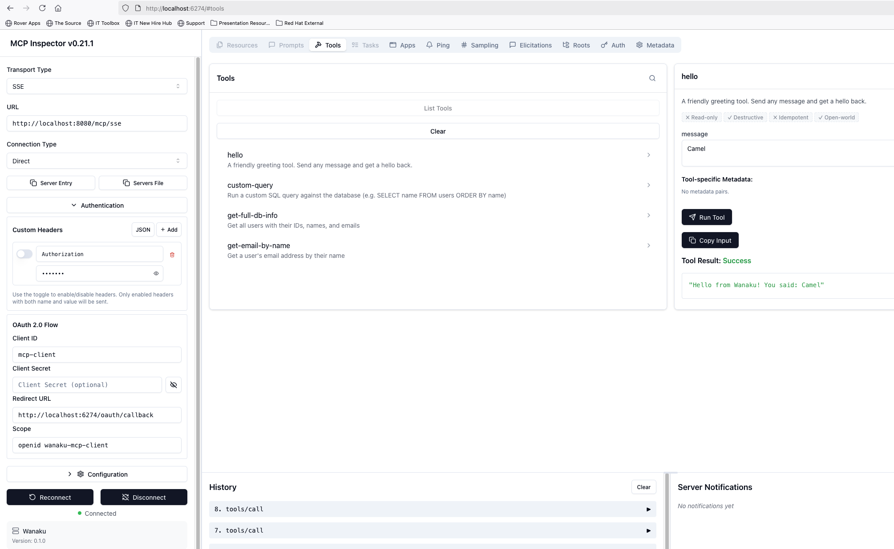

# Wanaku Quickstart

Get Wanaku running in 2 commands.

## Prerequisites

- Java 21+
- Docker or Podman

## Start

```bash
./download.sh    # download JARs (once)
./start.sh hello-tool postgres-tool file-resource      # start everything
```

## What gets started

The script launches the following:

1. **Keycloak** (container) — authentication server, manages users and OAuth tokens
2. **Wanaku Router** (Java process) — MCP Router that exposes tools and resources to AI agents
3. **PostgreSQL** (container, only for `postgres-tool`) — database backend
4. **Camel Integration Capability** (Java process, one per example) — connects Apache Camel routes to the Router as MCP tools/resources

Each capability is configured by YAML files in the `camel-integration-capabilities/` folder:
- `routes.camel.yaml` — Camel route (the logic)
- `rules.yaml` — MCP tool/resource definition (the contract)
- `dependencies.txt` — Maven dependencies downloaded at runtime (e.g. PostgreSQL driver)

```
AI Agent / MCP Inspector
    |  MCP protocol
    v
Wanaku Router (:8080)  <--auth-->  Keycloak (:8543)
    |  gRPC
    v
Camel Integration Capability (:9191, :9192, ...)
    |
    v
Backend (PostgreSQL, files, HTTP, etc.)
```

## Capabilities

Run one or multiple at once:

```bash
./start.sh                                      # hello-tool (default)
./start.sh postgres-tool                         # PostgreSQL query tool
./start.sh hello-tool postgres-tool              # both
./start.sh hello-tool postgres-tool file-resource # all three
```

### hello-tool

A greeting tool. In MCP Inspector call `hello` with `message: "world"`.

### postgres-tool

Three database tools backed by PostgreSQL. Starts a PostgreSQL container automatically.
- `get-full-db-info` — returns all users with IDs, names, and emails (no parameters)
- `custom-query` — run any SQL query (e.g. `SELECT name FROM users ORDER BY name`)
- `get-email-by-name` — pass a `name` (e.g. "Alice") to get their email

### file-resource

Exposes a file as an MCP resource. Registers a `readme` resource.

## Connect with MCP Inspector

```bash
npx @modelcontextprotocol/inspector
```

Fill in the connection form:

| Field | Value |
|-------|-------|
| **Transport Type** | `SSE` |
| **Endpoint URL** | `http://localhost:8080/mcp/sse` |
| **Authentication** | `Direct (OAuth)` |
| **Client ID** | `mcp-client` |
| **Client Secret** | _(leave empty)_ |
| **Redirect URI** | `http://localhost:6274/oauth/callback` |
| **Scope** | `openid wanaku-mcp-client` |

Click **Connect**, then login with `test-user` / `test-password`.



If you get an OAuth error: **Open Auth Settings** -> **Clear OAuth State** -> Connect again.

Or open the Web UI at http://localhost:8080 (same credentials).

## Logs

All logs are in the `logs/` directory — one file per process (Router + each Camel Integration Capability instance).

To follow logs in real time:

```bash
tail -f logs/router.log          # Router
tail -f logs/cic-hello-tool.log  # Camel Integration Capability instance
tail -f logs/cic-postgres-tool.log
```

## Status & Stop

```bash
./status.sh   # show what's running
./stop.sh     # stop everything
```

## Ports

| Service | Port |
|---------|------|
| Keycloak | 8543 |
| Router HTTP | 8080 |
| Router gRPC | 9090 |
| Camel Integration Capability | 9191, 9192, 9193... |
| PostgreSQL | 5432 (if needed) |

## Credentials

| What | Username | Password |
|------|----------|----------|
| MCP / Web UI | test-user | test-password |
| Keycloak admin | admin | admin |
